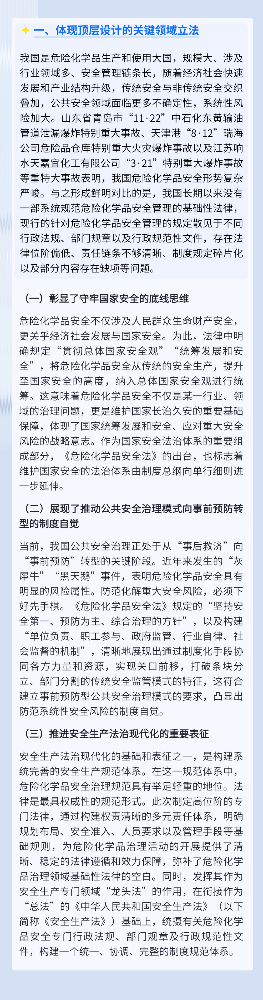
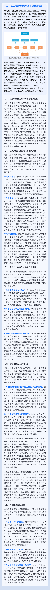
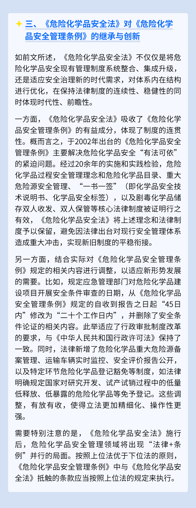
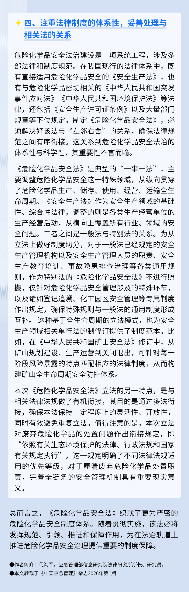

# 《危险化学品安全法》解读：以法治完善全链条安全治理

2025年12月27日，第十四届全国人大常委会第十九次会议审议通过了《中华人民共和国危险化学品安全法》（以下简称《危险化学品安全法》），将于2026年5月1日起施行。这是我国危险化学品安全领域一部专门性、基础性法律。该法贯彻落实党中央决策部署，全面总结实践经验，坚持问题导向，完善了危险化学品全链条安全治理机制和法律制度，为防范化解公共安全领域系统性风险、建设更高水平的平安中国提供了更加坚实的法治保障。

来源：中国应急管理杂志

编辑：省应急管理厅新闻宣传处、宣教中心
