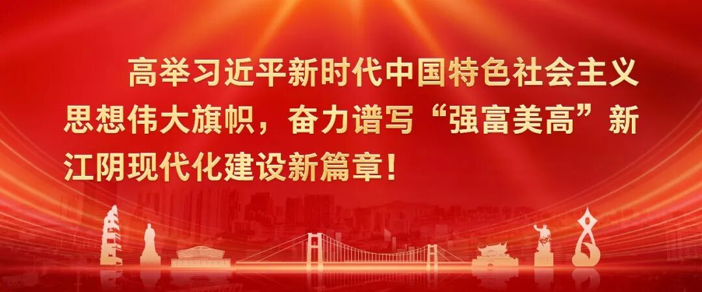
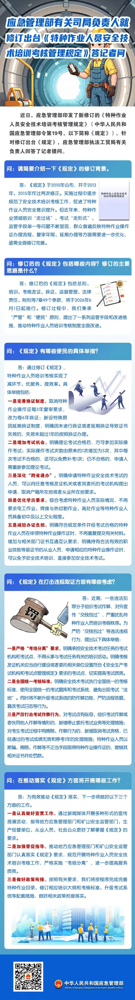

# 应急管理部有关司局负责人就修订出台《特种作业人员安全技术培训考核管理规定》答记者问

**点击蓝字 关注我们**

近日，应急管理部印发了新修订的《特种作业人员安全技术培训考核管理规定》（中华人民共和国应急管理部令第19号，以下简称《规定》）。针对修订出台《规定》，应急管理部执法工贸局有关负责人回答了记者提问。

**一、问：请简要介绍一下《规定》的修订背景。**

**答：**《规定》于2010年公布，并于2013年、2015年作过两次修正。实施过程中逐步规范了安全技术培训考核工作，促进了特种作业人员安全意识提升。但近年来，特种作业领域培训“走过场”、考试“走形式”、监管手段单一等问题不断显现，群众普遍反映特种作业操作证办理流程、复审年限、延期办理等方面需要进一步优化，亟需全面修订完善。

**二、问：修订后的《规定》包括哪些内容？修订的主要思路是什么？**

**答：**修订后的《规定》包括总则、培训、考核发证、换证、监督管理、法律责任、附则等7章49个条款，将于2026年6月1日起施行。修订过程中，我们秉承“严管”和“便民”原则，提出了一系列监管手段和改进措施，推动特种作业人员培训考核制度全面改进。

**三、问：《规定》有哪些便民的具体举措？**

**答：**通过修订《规定》，特种作业人员培训考核实现了减环节、优服务、提效率。具体举措包括：一是完善换证制度。取消特种作业操作证每3年复审要求，改为每6年换证；新设特殊原因延期换证制度，明确因未进行换证或者延期换证导致证书失效的，失效未超过1年的按照换证办理。二是增加考试机会。明确理论考试合格后，方可参加实际操作考试；实际操作考试次数由原来的1次增加为5次，其中每次考试不合格的，还可以免费补考1次；仍不合格的，申请人需重新参加理论考试。三是深化“跨省通办”。明确申请特种作业安全技术考试的人员，可以向任意考核发证机关或者其委托的考试机构提出申请，取消户籍所在地或者从业所在地要求。四是优化学历要求。综合考虑特种作业人员实际情况，不再要求电工作业、焊接与热切割作业、高处作业等特种作业人员具备初中及以上文化程度。五是减轻办证负担。明确符合规定条件并经考试合格的特种作业人员在申领特种作业操作证时，不再重复提交有关材料。增加与相关部门证书互通互认要求，明确持有合法有效的职业技能等级证书的从业人员，申请相应的特种作业操作证时，可以免予安全技术培训，直接参加安全技术考试。

**四、问：《规定》在打击违规取证方面有哪些考虑？**

**答：**近期，一些违法犯罪分子组织考试作弊，对外宣传“交钱包过”，严重扰乱特种作业人员培训考核秩序。为严防“交钱包过”等违法违规行为，提出以下具体举措：一是严格“考培分离”要求。明确承担安全技术考试任务的考试机构和考试点，不得从事与考试任务有关的培训活动。明确考核发证机关应当自行建设或者委托相关单位设置符合《安全生产考试机构和考试点管理规定》要求的考试点，切实提高考试质效。二是全国统一考核标准。明确安全技术考试执行全国统一的考核标准，使用全国统一的考试题库和考试系统，避免出现考试“洼地”。同时将不断升级考试系统的防作弊功能，严防远程答题、篡改考试日志等行为。三是严厉打击考试作弊行为。对考试点有纵容、组织考试作弊或者伙同他人作弊等情形的，新增停止委托考试业务等处理措施；对考生考试过程中有贿赂、作弊行为的，新增取消考试资格，已经通过的考试成绩无效和停考1年的处理措施；特种作业人员以欺骗、贿赂、作弊等不正当手段取得特种作业操作证的，撤销其相关证书并处罚款。

**五、问：在推动落实《规定》方面将开展哪些工作？**

**答：**为有效推动《规定》落实，下一步将做好以下三个方面的工作。一是认真做好宣贯工作。通过新闻媒体开展多种形式的宣传报道活动，指导地方应急管理部门和矿山安全监管部门、生产经营单位、从业人员、社会公众更好了解掌握《规定》的要求。二是加强督促指导。推动地方应急管理部门和矿山安全监管部门认真落实《规定》要求，规范开展特种作业人员安全技术培训考核工作，严格实施“考培分离”，进一步提高服务质效。三是做好政策衔接。按照有关要求，我们将按程序完成完善特种作业目录、修订相应培训大纲和考核标准、升级考试系统等配套措施，做好相关政策衔接落实。

---

来源：中华人民共和国应急管理部编辑：郭天琪审核：包凯凯发布：蒋岚

